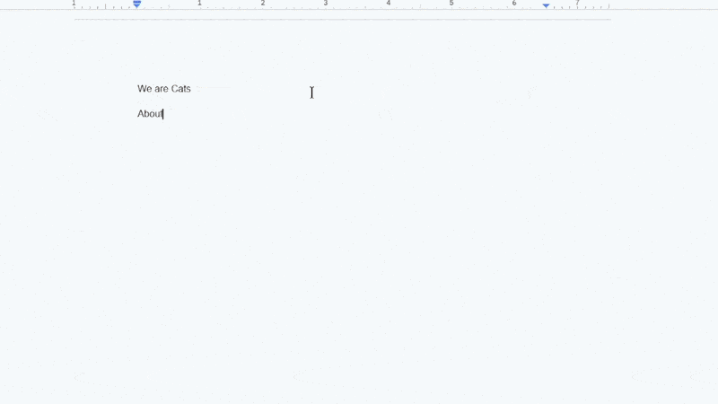

# **copy-chan — smol clipboard manager :3**



**copy-chan** is a cross-platform clipboard manager with an emoji and symbols picker, built with **Tauri**.
copy-chan aims to be a **privacy-respecting**, **persisting** clipboard manager for Windows, Mac and Linux platforms with features such as:

- ✅ **Data encryption**
- ✅ **Image snippets**
- ✅ **Custom limit for records (up to 100) before overwriting**
- ✅ **Persistent clipboard history even after restart**
- ✅ **A section for picking Emojis and symbols**
- ✅ **Customizable shortcut key**
- ✅ **Keyboard shortcut to open the app near user's cursor**
- ✅ **Small, native desktop experience using Tauri**

some features will be added in the future, like

- **Customizable theme**

and many more (≧◡≦)

## ⚠️ Prerequisites: Keyring Setup

This application relies on a system **keyring daemon to securely encrypt your saved clipboard data**.

### Platform Requirements:

- **Windows & macOS:**  
  No extra setup required! Windows Credential Manager and macOS Keychain are built-in and work automatically.

- **Linux Users:**  
  You **must** have a active **D-Bus Secret Service** daemon running for the app to store encryption keys.
  - **Ubuntu / GNOME / General:** Install `gnome-keyring` ([Setup Guide](https://wiki.archlinux.org/title/GNOME/Keyring)).
  - **KDE Plasma:** Ensure `kwallet` is active ([Setup Guide](https://docs.kde.org/stable5/en/kde-cli-tools/kcontrol5/kwallet5/index.html)).
  - **Hyprland / Sway / i3 Users:** Make sure your PAM module unlocks `gnome-keyring` or `kwallet` on startup ([Secret Service Guide](https://wiki.archlinux.org/title/Freedesktop.org_Secret_Service)).

## **Install**

you can find the latest version of copy-chan and it's preview versions in the [release](https://github.com/Smug-Cat-s-Den/Copy-Chan/releases) tab or the website [copy-chan](https://copychan.smgcat.site)

## **Tech stack**

- **Frontend :** React + TypeScript + Vite
- **Styling :** Tailwind CSS
- **Desktop level Apis :** Tauri Rust
- **Bundling :** Github Actions

## **🚧 Status : Stable on Windows, Mac, Linux x11 sessions**

This project is open-source for transparency and personal use. If you would like to make changes, please feel free to fork the repository. Bug reports are welcome. If you encounter any problems, feel free to open an issue on GitHub

## ▶️ Run locally

If you've never used Tauri before, you can find the official [docs]("https://tauri.app")

Prerequisites:

- NodeJS (v18+ recommended) and npm or pnpm
- Rust toolchain and cargo (for Tauri / desktop builds)
- Platform dependencies for WebKitGTK
- Keyring setup of your choice (Required for Linux users running minimal DE)

## Run the app in development mode:

To run the Tauri desktop build/dev mode (desktop + Rust backend) you can use the following mono repo commands:

```bash
git clone --filter=blob:none --sparse https://github.com/Smug-Cat-s-Den/Copy-Chan.git && cd Copy-Chan && git sparse-checkout add apps/desktop assets && pnpm i
```

install dependencies and start development with Tauri

```py
pnpm dev:desktop
```

then build native packages with the Tauri

```py
pnpm build:desktop
```
